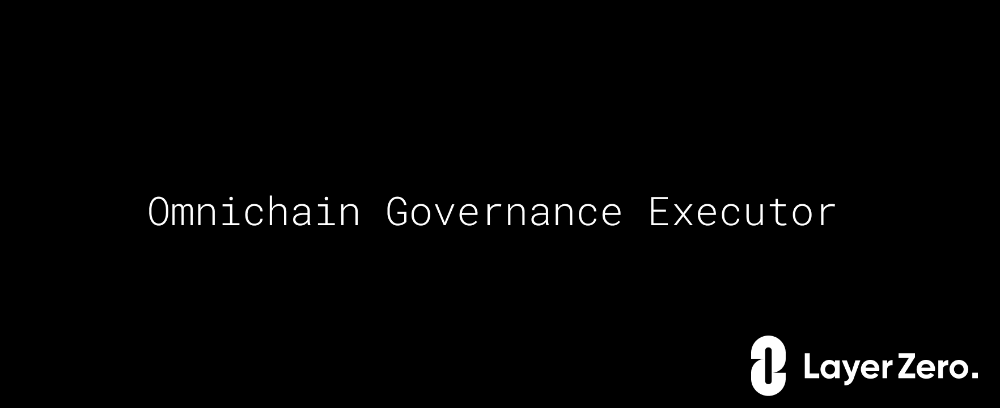

    

 

# Omnichain Governance Executor

Omnichain Governance Executor extends existing governance protocols (e.g., Compound [GovernorBravo](https://github.com/compound-finance/compound-protocol/tree/master/contracts/Governance)) with Layer Zero omnichain messaging protocol to enable cross-chain proposal execution.
The two main contracts are `OmnichainProposalSender` and `OmnichainGovernanceExecutor`.

`OmnichainProposalSender` allows sending proposal actions to other chains for execution. It has to be deployed on the main chain where voting is taking place (e.g., Ethereum). When used with `GovernorBravo` the owner of the `OmnichainProposalSender` must be set to `Timelock` contract.

`OmnichainGovernanceExecutor` executes the proposal actions on other chains. It must be deployed on each chain that needs to support the remote proposal execution. `OmnichainGovernanceExecutor` contract derives from [NonBlockingLzApp](https://github.com/LayerZero-Labs/solidity-examples/blob/main/contracts/lzApp/NonblockingLzApp.sol) and provides non-blocking message delivery, meaning failed messages won't block the message queue from the main chain. For the blocking behavior inherit the contract from [LzApp](https://github.com/LayerZero-Labs/solidity-examples/blob/main/contracts/lzApp/LzApp.sol).

 

## Getting Started

### Setup

- Clone the repository
- run `yarn`

### Test

`yarn test`

Run the full suite of unit tests.

### Coverage

`yarn coverage`

Get the coverage report.

 

## Deployment and configuration

1. Refer to [LayerZero gitbook](https://layerzero.gitbook.io/docs/technical-reference/mainnet/supported-chain-ids) for LayerZero Endpoint addresses and chain ids.
2. Deploy `OmnichainProposalSender` on the main chain (e.g. Ethereum) where voting is taking place. 
3. Deploy `OmnichainGovernanceExecutor` on each chain that needs to support remote proposal execution (e.g., Polygon, Arbitrum, Optimism, etc).
4. Call `setTrustedRemoteAddress` in `OmnichainProposalSender` for each remote chain providing LayerZero chain id and an address of `OmnichainGovernanceExecutor` contract on that chain.
5. Call `setTrustedRemoteAddress` in `OmnichainGovernanceExecutor` on each remote chain proving the main chain id and an address of `OmnichainProposalSender`
6. Optionally set a custom configuration (e.g. Oracle, Relayer, number of confirmations) by calling `setConfig` in `OmnichainProposalSender` and all `OmnichainGovernanceExecutor`.
7. Transfer ownership of `OmnichainProposalSender` to a contract that executes a proposal. For `GovernorBravo` it's `Timelock` contract. 
8. Transfer ownership of each `OmnichainGovernanceExecutor` to itself or a `Timelock` contract.

 

## Creating remote proposal

For each remote chain do the following:
1. Encode the proposal actions that need to be executed as follows `payload = abi.encode(targets, values, signatures, calldatas)`
2. Call `estimateFees` in `OmnichainProposalSender` passing the remote chain id, the payload constructed in the previous step and adapter parameters. Adapter parameters allow specifying the amount of gas required on destination to execute the proposal. We recommend testing the execution logic on the destination chain to determine the required amount. To learn more about adapter parameters refer to [LayerZero gitbook](https://layerzero.gitbook.io/docs/evm-guides/advanced/relayer-adapter-parameters)
3. Create a proposal action as follows:
- `target` an address of `OmnichainProposalSender` contract
- `value` LayerZero fee for message delivery. Generally it should be equal to `nativeFee` obtained in the previous step by calling `estimateFees`. However, since there is a significant time period between the proposal creation and execution, the fees estimation might be inaccurate and we highly recommend increasing the amount of fees passed (e.g., `nativeFee.mul(2)`). Unused amount will be refunded to the address that initiated the proposal execution on the main chain (`tx.origin`)
- `signature` the signature of `execute` function in `OmnichainProposalSender` contract (`"execute(uint16,bytes,bytes)"`)
- `calldata` the encoded parameters of `execute` function in `OmnichainProposalSender`  (`abi.encode(remoteExecutorChainId, payload, adapterParams)`)
4. Pass the values as part of the corresponding arrays in `propose` function of `GovernorBravoDelegate` contract

When `Timelock` contract executes the proposal it calls `execute` function in `OmnichainProposalSender` which sends the proposal actions to the remote chain.

 

## Retrying failed message on the source chain

Sending a message might fail on the main chain the calling `execute`. The most common reason for this is insufficient fees supplied.
To retry a failed message do the following:
1. Find `StorePayload` event that was emitted.
2. If the reason indicates insufficient fees, call `estimateFees` again
3. Call `retryExecute` in `OmnichainProposalSender` supplying the parameters from the event and the fees obtained in the previous step

 

## Deployed contracts for Uniswap Governance

| Chain     | Contract                     | Address                                                                                                                |
| --------- | ---------------------------- |------------------------------------------------------------------------------------------------------------------------|
| Ethereum  | OmnichainProposalSender      | [0xeb0BCF27D1Fb4b25e708fBB815c421Aeb51eA9fc](https://etherscan.io/address/0xeb0BCF27D1Fb4b25e708fBB815c421Aeb51eA9fc)| 
| Avalanche | OmnichainGovernanceExecutor  | [0xeb0BCF27D1Fb4b25e708fBB815c421Aeb51eA9fc](https://snowtrace.io/address/0xeb0BCF27D1Fb4b25e708fBB815c421Aeb51eA9fc)|
